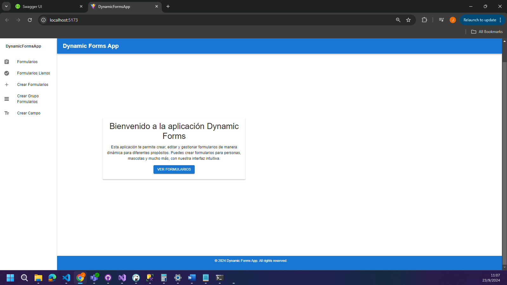
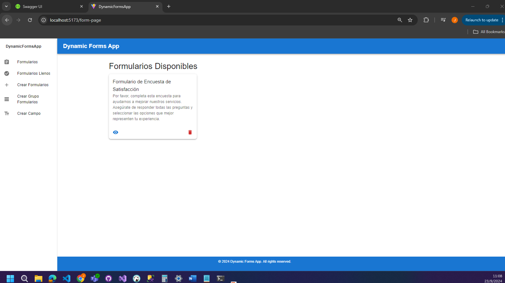
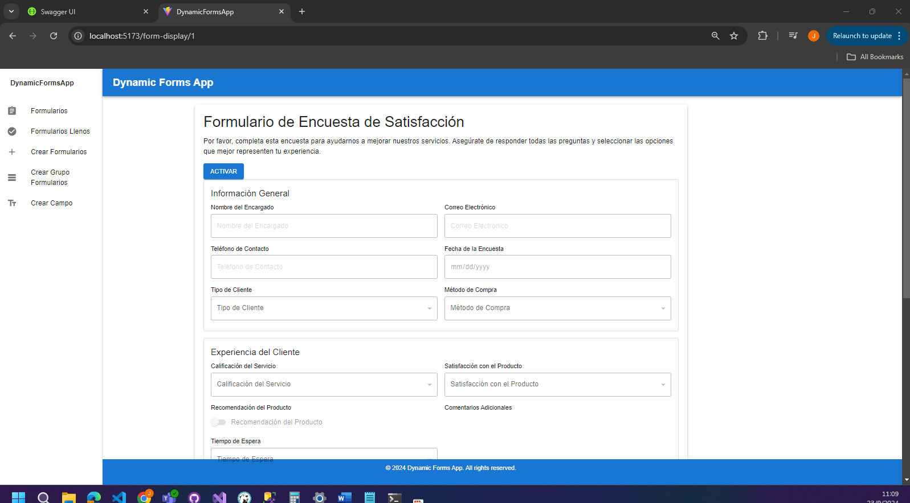
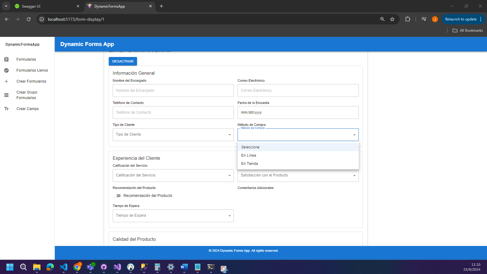
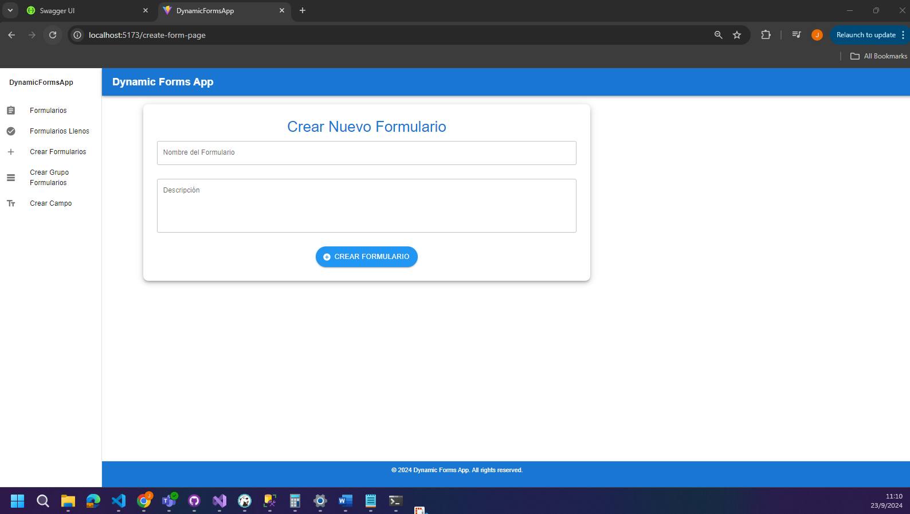
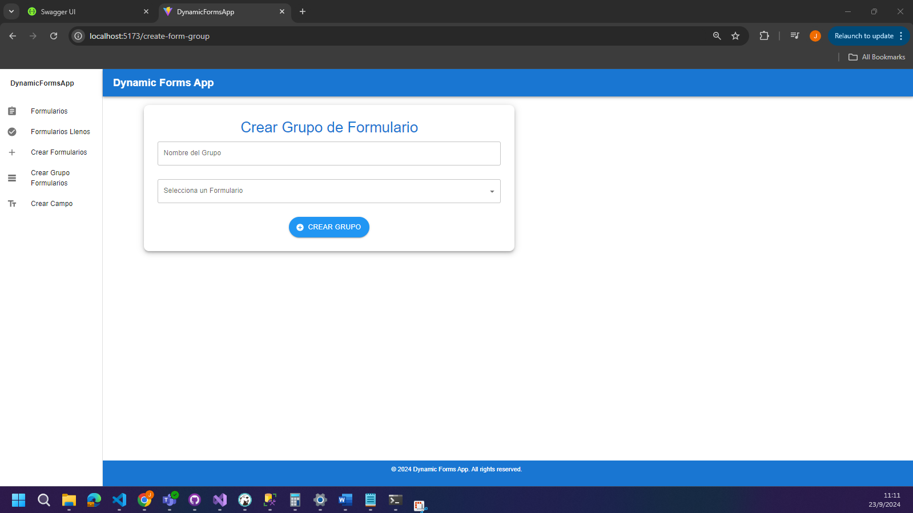
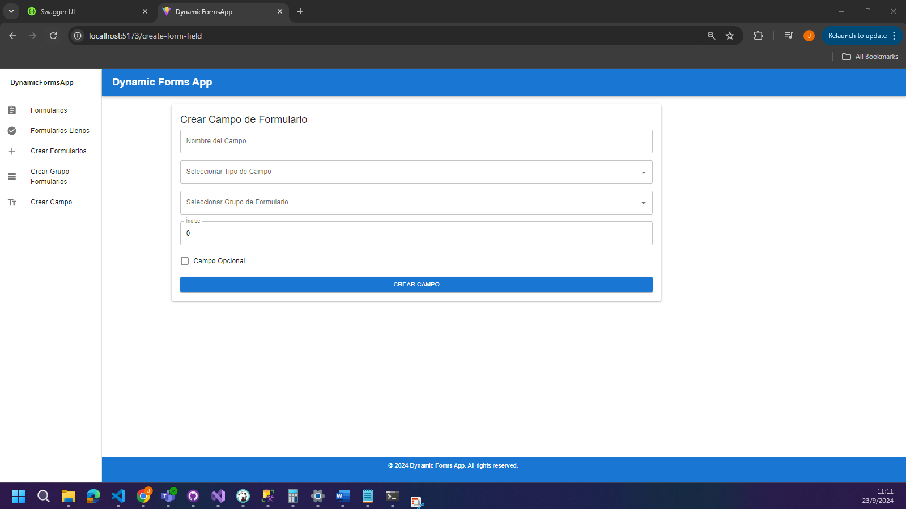
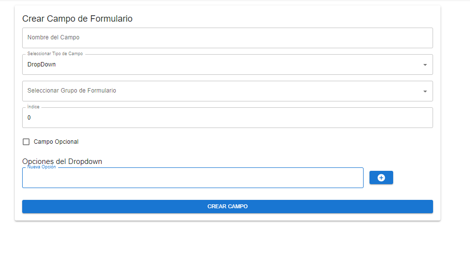
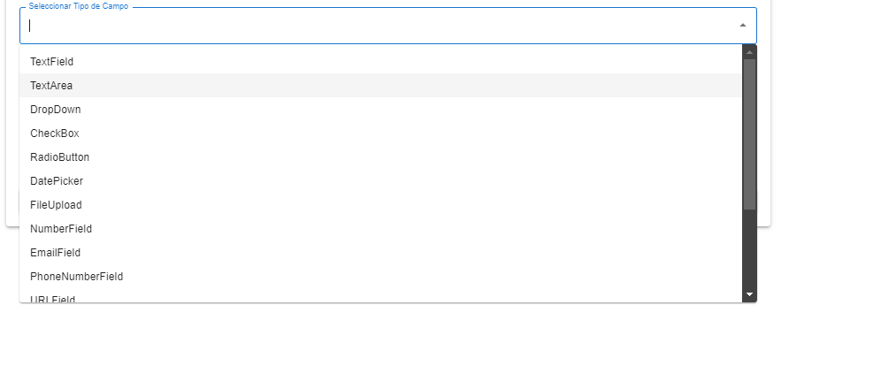

# Guía de Instalación y Configuración

## Restaurar la Base de Datos

1. **Restaurar la Base de Datos desde el Archivo `.bak`:**
   - **Archivo de Respaldo:** `DynamicDB.bak`
   - **Descripción:** Este archivo `.bak` contiene la información necesaria para ejecutar el proyecto. Asegúrate de restaurar este archivo en tu servidor SQL para tener acceso a los datos requeridos por la aplicación.

2. **Pasos para Restaurar:**
   - Abre **SQL Server Management Studio (SSMS)**.
   - Conéctate a tu servidor SQL.
   - Haz clic derecho en **Bases de Datos** y selecciona **Restaurar Base de Datos**.
   - En la ventana de restauración, elige **Dispositivo** y selecciona el archivo `DynamicDB.bak`.
   - Asegúrate de que la base de datos restaurada se llame `DynamicDB` o el nombre que desees utilizar.

## Configuración del Backend

1. **Abrir el Proyecto Backend:**
   - Navega a la carpeta `FormDynamicAPI`.
   - Abre el archivo `FormDynamicAPI.sln` en Visual Studio.

2. **Configurar la Conexión a la Base de Datos:**
   - Abre el archivo `appsettings.json`.
   - Modifica las secciones de `Development` y `Production` para establecer la conexión a tu base de datos. Asegúrate de proporcionar el `DataSource` y el `Catalog` correctos, que deberían corresponder al nombre de la base de datos restaurada.

3. **Ejecutar el Backend:**
   - Una vez configurado, puedes ejecutar el backend desde Visual Studio.

## Configuración del Frontend

1. **Abrir el Proyecto Frontend:**
   - Navega a la carpeta `FormDynamicWeb/DynamicFormsApp`.

2. **Instalar Dependencias:**
   - Abre una terminal en la carpeta del proyecto y ejecuta:
     ```bash
     npm install
     ```

3. **Configurar la URL Base:**
   - Asegúrate de que el archivo `baseurl.ts` tenga el enlace correcto a tu entorno local o al entorno de desarrollo. Verifica que la URL esté configurada para apuntar a tu backend local.

4. **Ejecutar el Frontend:**
   - Una vez que todo esté configurado, puedes iniciar el frontend ejecutando:
     ```bash
     npm run dev
     ```

   - La aplicación debería estar disponible en tu navegador.

¡Con estos pasos, deberías estar listo para usar la aplicación Dynamic Forms! Si encuentras algún problema, no dudes en consultar la documentación o ponerte en contacto con el soporte.









